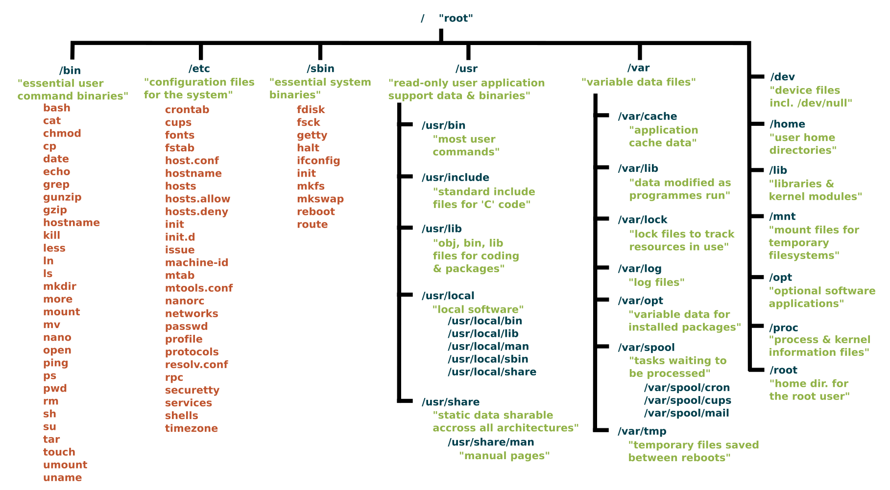

# Linux Basics

TODO: Add screenshots/code examples for each command; put commands in tables; clean and organize all \(issue [\#7](https://github.com/zweilosec/Infosec-Notes/tree/9375dea2ecb0e3feeda3395c360ea20793d94891/issues/7/README.md)\)

## Command-line Basics

<table>
  <thead>
    <tr>
      <th style="text-align:left">Command</th>
      <th style="text-align:left">Description</th>
    </tr>
  </thead>
  <tbody>
    <tr>
      <td style="text-align:left"><code>man $command</code>
      </td>
      <td style="text-align:left">Get help with a command</td>
    </tr>
    <tr>
      <td style="text-align:left"><code>history</code>
      </td>
      <td style="text-align:left">View history of commands that have been typed into the terminal</td>
    </tr>
    <tr>
      <td style="text-align:left"><code>!&lt;number&gt;</code>
      </td>
      <td style="text-align:left">Repeat a specific command from command history</td>
    </tr>
    <tr>
      <td style="text-align:left"><code>Ctrl + r</code>
      </td>
      <td style="text-align:left">Search through command history: then cycle with Up or Down arrows. (Do
        not need to type <code>history</code> command first)</td>
    </tr>
    <tr>
      <td style="text-align:left"><code>alt + .</code>
      </td>
      <td style="text-align:left">Cycle through previously used command arguments</td>
    </tr>
    <tr>
      <td style="text-align:left"><code>ctrl + [arrow_keys]</code>
      </td>
      <td style="text-align:left">Move between &quot;words&quot; on a command line</td>
    </tr>
    <tr>
      <td style="text-align:left"><code>clear</code>
      </td>
      <td style="text-align:left">Clear all text off the terminal window</td>
    </tr>
    <tr>
      <td style="text-align:left"><code>echo $text</code>
      </td>
      <td style="text-align:left">
        <p>Print string to terminal.</p>
        <ul>
          <li>Most useful when piped into other commands.</li>
          <li>Can be used to display environment variables such as <code>$USER</code>, <code>$HOME</code>, <code>$PATH</code>
          </li>
        </ul>
      </td>
    </tr>
    <tr>
      <td style="text-align:left"><code>Ctrl + Shift + c</code>
      </td>
      <td style="text-align:left">Copy selected text</td>
    </tr>
    <tr>
      <td style="text-align:left"><code>Ctrl + Shift + v</code>
      </td>
      <td style="text-align:left">Paste clipboard contents</td>
    </tr>
    <tr>
      <td style="text-align:left"><code>lp $filename</code>
      </td>
      <td style="text-align:left">Print from file to printer</td>
    </tr>
    <tr>
      <td style="text-align:left"><code>cd $directory</code>
      </td>
      <td style="text-align:left">Change directories</td>
    </tr>
    <tr>
      <td style="text-align:left"><code>cd ..</code>
      </td>
      <td style="text-align:left">Move up one directory</td>
    </tr>
    <tr>
      <td style="text-align:left"><code>cd ~</code>
      </td>
      <td style="text-align:left">Change directory to current user&apos;s home directory</td>
    </tr>
    <tr>
      <td style="text-align:left"><code>cd -</code>
      </td>
      <td style="text-align:left">Return to previous directory</td>
    </tr>
    <tr>
      <td style="text-align:left"><code>exit</code>
      </td>
      <td style="text-align:left">Exit terminal session</td>
    </tr>
  </tbody>
</table>

### Special Symbols

| `Symbol` | Purpose |
| :--- | :--- |
| `|` | Send the output of one command to another. |
| `>` | Redirect output to a file. |
| `<` | Redirect input from a file. |
| `>>` | Append output to an existing file. |
| `/` | Separator used in path names. |
| `\` | Used to escape characters and to send multi-line commands. |
| `.` | Current directory. |
| `..` | Parent directory. |
| `$$` | displays the process ID of the current shell instance. |
| `&` | Process command in the background \(and give control of the terminal back\). |
| `&&` | Run the next command only if the previous completed successfully. |
| `*` | Match any number of characters in file name. |
| `?` | Match any single character in file name. |
| `[ ]` | Match any one of the enclosed characters in file name. |
| `;` | Run commands in sequence, regardless if the previous succeeded. |
| `( )` | Group commands. |
| `{ }` | Used to feed multiple parameters to a single command.  Separate parameters by `,` |
| `!` | Followed by a digit will repeat the command from the history file that corresponds. |
| `!!` | Repeat the previous command. |
| `0` | Shortcut that stands for Standard Input \(STDIN\) |
| `1` | Shortcut that stands for Standard Output \(STDOUT\) |
| `2` | Shortcut that stands for Standard Error \(STDERR\) |

### Recover an unresponsive terminal

1. Press the **RETURN/ENTER** key.

   You may have typed a command but forgotten to press **RETURN** to tell the shell that you’re done typing and it should now interpret the command.

2. If you can type commands, but nothing happens when you press **RETURN**, try typing **CTRL-J**. If this works, your terminal needs to be reset to fix the **RETURN** key. Some systems have a **reset** command that you can run by typing **CTRL-J** **reset** **CTRL-J**. If this doesn’t work, you may need to log out and log back in or turn your terminal off and on again.
3. If your shell has job control type **CTRL-Z**.

   This suspends a program that may be running and gives you another shell prompt. Now you can enter the **jobs** command to find the program’s name, then restart the program with **fg** or terminate it with **kill**.

4. Use your interrupt key \(typically **DELETE** or **CTRL-C\)**.

   This interrupts a program that may be running. \(Unless a program is run in the background as the shell will wait for it to finish before giving a new prompt. A long-running program may thus appear to hang the terminal.\) If this doesn’t work the first time, try it once more, though doing it more than twice usually won’t help.

5. Type **CTRL-Q**.

   If output has been stopped with **CTRL-S**, this will restart it. \(Note that some systems will automatically issue **CTRL-S** if they need to pause output; this character may not have been typed by the user from the keyboard.\)

6. Check that the **SCROLL LOCK** key is not toggled on.

   This key stops the screen display from scrolling upward. If pressing it once does not work, make sure you’ve pressed it an even number of times as this leaves the key in the same state it was when you started.

7. Type **CTRL-D** at the beginning of a new line.

   Some programs \(like **mail**\) expect text from the user. A program may be waiting for an end-of-input character from you to tell it that you’ve finished entering text. However, typing **CTRL-D** may cause you to log out, so you should only try this as a last resort.

8. If you’re using a windowing system, close \(or terminate\) the terminal window and open a new one.

## Filesystem Basics



Everything in Linux is a file, even directories and devices. Directories have some special restrictions, but for the most part can be treated like files.

### Listing and viewing Directories and Files

<table>
  <thead>
    <tr>
      <th style="text-align:left">Command</th>
      <th style="text-align:left">Description</th>
    </tr>
  </thead>
  <tbody>
    <tr>
      <td style="text-align:left"><code>ls -a</code>
      </td>
      <td style="text-align:left">
        <p>List files in a folder, to include hidden files:</p>
        <ul>
          <li>Hidden files in Linux begin with a <b><code>.</code></b> these files can
            still be accessed normally, but the <b><code>.</code></b> must be added to
            the name.</li>
        </ul>
      </td>
    </tr>
    <tr>
      <td style="text-align:left"><code>ls -la</code>
      </td>
      <td style="text-align:left">List files with attributes (filesize, permissions, etc.)</td>
    </tr>
    <tr>
      <td style="text-align:left"><code>ls -lS</code>
      </td>
      <td style="text-align:left">List files, sorted by Size</td>
    </tr>
    <tr>
      <td style="text-align:left"><code>ls -R</code>
      </td>
      <td style="text-align:left">List files in current folder and all subfolders (Recursive)</td>
    </tr>
    <tr>
      <td style="text-align:left"><code>find -L / -samefile $file</code>
      </td>
      <td style="text-align:left">Locate all files that symlink to a file</td>
    </tr>
    <tr>
      <td style="text-align:left"><code>which $file</code>
      </td>
      <td style="text-align:left">Searches for files in a <code>$PATH</code> directory only.</td>
    </tr>
    <tr>
      <td style="text-align:left"><code>locate $file</code>
      </td>
      <td style="text-align:left">Uses a database to search for files. Update the database with <b><code>sudo updatedb</code></b>
      </td>
    </tr>
    <tr>
      <td style="text-align:left"><code>df</code>
      </td>
      <td style="text-align:left">List the size, used space, and available space on the mounted filesystems
        of your computer</td>
    </tr>
    <tr>
      <td style="text-align:left"><code>cat $file</code>
      </td>
      <td style="text-align:left">Print the contents of a file to the command line</td>
    </tr>
    <tr>
      <td style="text-align:left"><code>cat $file1 $file2 &gt; $newfile</code>
      </td>
      <td style="text-align:left">Combine the contents of two text files</td>
    </tr>
    <tr>
      <td style="text-align:left"><code>diff $file1 $file2</code>
      </td>
      <td style="text-align:left">Compare two files and show differences (Only for text-based files)</td>
    </tr>
    <tr>
      <td style="text-align:left"><code>grep $string $file</code>
      </td>
      <td style="text-align:left">Search for string inside a file</td>
    </tr>
    <tr>
      <td style="text-align:left"><code>head $file</code>
      </td>
      <td style="text-align:left">Displays the first 10 lines of a file. Specify the number of lines with <code>-#</code>
      </td>
    </tr>
    <tr>
      <td style="text-align:left"><code>tail $file</code>
      </td>
      <td style="text-align:left">Displays the last 10 lines of a file. Specify the number of lines with <code>-#</code>
      </td>
    </tr>
    <tr>
      <td style="text-align:left"><code>file $file</code>
      </td>
      <td style="text-align:left">Displays the filetype of a file, determined by the hexadecimal &quot;
        <a
        href="https://blog.netspi.com/magic-bytes-identifying-common-file-formats-at-a-glance/">magic bytes</a>&quot;.</td>
    </tr>
  </tbody>
</table>

### File and directory creation and deletion

| Command | Description |
| :--- | :--- |
| `touch $fileName` | Create a new blank file with this name |
| `cp $file [/path/to/]$newFile` | Copy file from one location to another.  If no location is specified, creates the copy in the same directory. |
| `mv $file [/path/to/]$newFile` | Move file from one location to another.  If no location is specified, renames the file in same directory \(removes the old file\). |
| `rm $file` | Removes \(deletes\) a file.  |
| `rm *` | Removes \(deletes\) all files in the directory. |
| `rm -rf *` | Recursively deletes all files in the directory and all subdirectories and files.  Will not prompt for approval with `-f`.  |
| `mkdir [/path/to/]$dir` | Makes a new empty directory |
| `mkdir -p test/{test1,test2}` | The `-p` flag creates multiple directories at once.  In this example we use brace expansion to create `test/` and 2 subdirectories under it. |
| `rmdir $dir` | Deletes an empty directory |
| `sudo rm --force $(which $file)` | Removes all instances of a specified filename.  Only searches PATH directories.  You could also use `find` or `locate` instead of `which` to find more files.  With `--force` will not prompt for approval! |

### File & text manipulation

| Command | Description |
| :--- | :--- |
| `cat $file1 $file2` | Concatenates the contents of two files |
| `wc` | Counts the lines, words, and bytes in a file.  `-l` will count only lines, `-m` will count only characters, `-c` will count only bytes,  `-w` will count only words |
| `awk` | A programming language for text processing. Can do many many things. |
| `sed` | Performs text editing on a stream of text. Useful for replacing text in a file and much more |
| `cut` | Extract a section of text.  **`-f`** selects the field, **`-d`** sets the delimiter.  |
| `sort` |  |
| `uniq` |  |

```text
cat > $fileName
 [Type your file contents]
 [Press `Ctrl+d` to return to your terminal]
```

### File Permissions

> TODO: Add more information about Linux file permissions \(both `octal` and `ugo-rwx` formats\); Add information about `chmod` and `chown` commands; Add descriptions and examples \(issue [\#8](https://github.com/zweilosec/Infosec-Notes/issues/8)\)

File permissions in linux can be expressed in two formats, the rwx and the octal notation.

#### rwx notation

r = read
w = write
x = execute

In linux the if the permission of a file would be :

`-rwxrwxrwx`

Then that would mean that the anyone can read, write and execute the file. Breaking down this format into four parts :
1. The first character would tell if it is a file or a directory, if it is a '-' (hyphen) then it would mean it is a file, but if it is 'd', then
   it would mean that it is a directory.
2. The next three characters specify the permission of the owner of the file.
3. The next three character specify the permissions of the group.
4. The last three character would specify the characters of others.

In the above example all of them had rwx assigned to them, hence anyone could read, write and execute this file.

#### Octal notation

In the octal notation, the permissions are assigned using octal digits.

|  Permissions  |  binary notation  |  octal notation  |  Description  |
|  :---  |  :---  |  :---  |  :--  |
|  ---  |  000  |  0  |  No permission  |
|  --x  |  001  |  1  |  Execute permission only  |
|  -w-  |  010  |  2  |  Write permission only  |
|  -wx  |  011  |  3  |  Write and execute  |
|  r--  |  100  |  4  |  Read permission only  |
|  r-x  |  101  |  5  |  Read and execute permission  |
|  rw-  |  110  |  6  |  Read and write permission  |
|  rwx  |  111  |  7  |  Read, write and execute  |

From the above table we can easily derive :

Read    = 4
Write   = 2
Execute = 1

Therefore if you would want to give a read and write, it would be 6 (4+2=6).

Now taking the same above example of -rwxrwxrwx  :
In order to assign a file this permission using the octal notation and chmod
it would be :

`chmod 777 file`

The first 7 would mean for the owner (4+2+1), the second 7 for the group and the third one for others.

u = user
g = group
o = others
a = u+g+o (all)

You can also give permissions using this method :

`chmod a+w file`

The above example would give write permissions to everyone.

`chmod a-x file`

The above example would remove execute permissions for everyone.

#### Advanced permissions

Other than just read and write, you can also set some other permissions like SUID and GUID.

`chmod 4000 file`
`chmod +s file`

Both the above examples would add the setuid bit to the file.

`chmod 2000 file`
`chmod +g file`

Both the above examples would add the getuid bit to the file

The sticky bit is added to folders mainly in order to prevent anyone else from deleting the folder.
or any of it's contents. It is represented by a 't' at the end. When a sticky bit is set, nobody other than
the owner or the root can delete the folder or the file.

`chmod 1000 folder`
`chmod +t folder`

Both the above examples set the sticky bit to the folders

Examples:
`chmod 1744 file`
This would set the sticky bit, give all permissions to the owner and only read permission to the group and others

`chmod 0600 file`
This would only give the owner read and write permission, but not execute permission.

#### chown command

The chown command can be used to change the owner of a file or a directory.

`chown $user $group $file`

The above command would change the owner of the file from root to $user and also the group to $group


### File compression and encryption

| Command | Description |
| :--- | :--- |
| unzip |  |
| gunzip |  |
| tar |  |

## System Information

| Command | Description |
| :--- | :--- |
| `uname -a` | List OS, hostname, kernel build number, CPU architecture |
| `ps` | List running processes \(current user\) |
| `ps aux` | List running processes for all users \(if permitted\) |
| `top` | Similar to Windows Task Manager, lists running processes with details of hardware usage |
| `systemctl list-unit-files` | Show list of all services installed with status |

## Networking

| Command | Description |
| :--- | :--- |
| `ifconfig` | Get networking information \(IP, Subnet mask, MAC, etc.\); On some systems may require **`sudo`** rights |
| `ip a` | Get networking information \(IP, Subnet mask, MAC, etc.\); No **`sudo`** required. Newer |
| `ifconfig $interface $ip/$CIDR` | Set IP address for an interface |
| `ifconfig $interface mtu $size` | Change MTU size for an interface |
| `ifconfig $interface hw ether $new_MAC` | Change MAC address \(or use `macchanger`\) |

### Managing connections

TODO: add more information about Managing connections in Linux \(Issue [\#9](https://github.com/zweilosec/Infosec-Notes/issues/9)\)

* Add commands such as telnet, SSH, nc, curl, wget
* Add commands for listing information about open network connections: lsof -i, ss, netstat
* include description and examples

| Command | Description |
| :--- | :--- |
| `telnet` |  |
| `SSH` |  |
| `nc` |  |
| `curl` |  |
| `wget` |  |

nc listener: `nc -lvnp <port>`

#### list open network connections

| Command | Description |
| :--- | :--- |
| `lsof -i` |  |
| `ss` | Shows State, data sent/recieved, local process:port, remote address:port |
| `ss -anlp` | Get all connections that are listening, do not resolve names, show process information |
| `netstat` |  |

### Shared folders

| Command | Description |
| :--- | :--- |
| `showmount -e $ip` | Show available shares to mount |
| `smb://$ip/$share_name` | Connect to Windows SMB share folder |

TODO: add more information on mounting and using network shares \(issue [\#10](https://github.com/zweilosec/Infosec-Notes/issues/10)\)

* Add information on creating, mounting, and connecting to network shares \(Samba, SMB, etc.\)
* pull more information from HTB Writeups \([Resolute](https://github.com/zweilosec/htb-writeups/blob/f1424824de53334bfff1a62ace34f6d23e77cfef/windows-machines/medium/resolute-write-up.md), [Remote](https://github.com/zweilosec/htb-writeups/blob/da514f8ff85dfaf164f78e776b8b987e6e346f14/windows-machines/easy/remote-write-up.md), and [Fuse](https://github.com/zweilosec/htb-writeups/blob/f1424824de53334bfff1a62ace34f6d23e77cfef/windows-machines/medium/fuse-write-up.md) for example, as well as outside sources\)
* Add commands such as `smbclient`, `smbpass`, `showmount`, `mount`, [Downloading Files](https://github.com/zweilosec/htb-writeups/blob/f1424824de53334bfff1a62ace34f6d23e77cfef/windows-machines/medium/nest-write-up.md#copying-an-entire-smb-folder-recursively-using-smbclient), [Detecting ADS](https://github.com/zweilosec/htb-writeups/blob/f1424824de53334bfff1a62ace34f6d23e77cfef/windows-machines/medium/nest-write-up.md#useful-skills-and-tools), [`smbmap`](https://github.com/zweilosec/htb-writeups/blob/f1424824de53334bfff1a62ace34f6d23e77cfef/windows-machines/medium/cascade-write-up.md#useful-skills-and-tools),

### DNS

| Command | Description |
| :--- | :--- |
| `dig @$server $domain_or_ip $record_type` | Look up DNS information for a site |
| `dig -x $ip` | Reverse look up a domain from an IP |

## Installing and Managing Programs

| Command | Description |
| :--- | :--- |
| `sudo apt update` | Update repository database |
| `sudo apt upgrade` | Update installed programs and packages \(must update repository database first\).  Adding `-y` will accept all prompts and install automatically.  Specifying a package name after "upgrade" will upgrade only that package. |
| `sudo apt dist-upgrade` |  |
| `sudo apt full-upgrade` |  |
| `apt search $keyword` | Search for packages \(unknown name\) to install from repositories |
| `apt-cache search $keyword` | Search for package in repositories |
| `apt show $package` | Show details about the specified package |
| `sudo apt install $package` | Installs the specified package \(and any dependencies\). |
| `apt remove --purge $package` | Uninstalls the specified package |
| `dpkg -i $deb_file`  | Installs the specified `.deb` package file \(Does not install dependencies\). |
| `alien $file.rpm` | Convert rpm to Debian packages |

## Users and Groups

TODO: Add information about Linux Users and Groups \(issue [\#11](https://github.com/zweilosec/Infosec-Notes/issues/11)\)

* Add information about creating, modifying, and deleting users and passwords
* Add information about use, creation, modification, and deletion of groups
* Add commands such as `adduser`, `groups`, `passwd`, etc.
* Add commands related to listing users, seeing who is logged in, etc. \(`id`, `w`, `last -a`\)
* add descriptions and examples

| Command | Description |
| :--- | :--- |
|  |  |
| `env` | Displays all environment variables for the current context. |

`groups`

Add a new user: `adduser`

`addgroup`

`id`

`w`

`last -a`

### User Privileges

| Command | Description |
| :--- | :--- |
| `sudo $command` | Execute commands with elevated privileges |
| `sudo -u $username $command` | Execute `sudo` command using another user's privileges |
| `sudo -l` | List `sudo` privileges for current user with |
| `sudo -k` | Stop remembering credentials and re-prompt for password |
| `/etc/sudoers` | Configuration file for `sudo` |

## $PATH

Add new $PATHs to `.profile` rather than `.bashrc`, then `source ~/.profile` to use new PATHs

Makes `pwd` part of path so don't need `./` _NOT RECOMMENDED for home/production use!_ `export PATH='pwd':$PATH`

The bulletproof way to add a path \(e.g., ~/opt/bin\) to the PATH environment variable is:

```bash
PATH="${PATH:+${PATH}:}~/opt/bin"
#for appending (instead of PATH="$PATH:~/opt/bin")

PATH="~/opt/bin${PATH:+:${PATH}}"
#for prepending (instead of PATH="~/opt/bin:$PATH")
```

\(from [https://unix.stackexchange.com/questions/26047/how-to-correctly-add-a-path-to-path](https://unix.stackexchange.com/questions/26047/how-to-correctly-add-a-path-to-path)\)

## Startup Scripts

Add script to run at startup: `update-rc.d </path/to/the/script> defaults` \(needs 755 permissions\)

Delete script from default autorun: `update-rc.d -f </path/to/the/script> remove`

## Make a Linux live boot USB

On Windows \(easiest way!\):

1. Download and run [Rufus](https://rufus.ie/).
2. Select the USB device and ISO you want to use, giving the volume a name if you wish.
3. If you want to use persistence,
   1. Click "Show advanced drive options".
   2. Select the amount of storage to use for persistence.
4. Click "Start" and wait for it to finish.

For Kali live persistent boot USBs you will need the additional step of adding a `persistence.conf` by following the instructions below.

1. Verify your USB devices persistent storage partition with the command `fdisk -l`.
2. After locating your partition \(in this example it is `/dev/sdb3`\), label it `persistence`.

   ```text
   e2label /dev/sdb3 persistence
   ```

3. Create a mount point, mount the new partition there, and then create the configuration file to enable persistence. Finally, unmount the partition.

   ```text
   mkdir -p /mnt/my_usb
   mount /dev/sdb3 /mnt/my_usb
   echo "/ union" > /mnt/my_usb/persistence.conf
   umount /dev/sdb3
   ```

## Fork Bomb

A fork bomb is a type of denial-of-service attack against Unix-based systems, which makes use of the fork operation \(or equivalent functionality\) whereby a running process spawns another running process indefinitely. This attack works by creating a large number of processes very quickly in order to saturate the available resources of the operating system.

Once this code is executed, within seconds the target system will freeze and will have to hard rebooted.

A common succinct bash fork bomb looks like:

```text
:(){:|:&};:
```

Which can be explained as:

| Function | Description |  |
| :--- | :--- | :--- |
| `:()` | define a function named `:` . Whenever we call `:`, execute the commands inside the `{ }` |  |
| \`: | :\` | load a copy of the **`:`** function into memory and pipe its output to another copy of the **`:`** function, which has to also be loaded into memory separately. |
| `&` | Disowns the other functions. If the first **`:`** is killed, all of the functions that it started should NOT also be killed. |  |
| `;` | Ends the function definition and tells the interpreter to run what is next as a command |  |
| `:` | Call function `:` initiating a chain-reaction: each call of `:` will start two more |  |

It can also be written as:

```text
forkbomb() { forkbomb | forkbomb & } ; forkbomb
```

## Fixing `command-not-found` errors

[https://stackoverflow.com/questions/19873430/command-not-found-message-when-i-try-to-add-command-in-bashrc/26976325](https://stackoverflow.com/questions/19873430/command-not-found-message-when-i-try-to-add-command-in-bashrc/26976325)

If you encounter errors on your system when you mistype a command or try to run a program that is not installed try these steps to fix the `command-not-found` command.

TODO: screenshot or type out example so people know what I am referring to...

```bash
sudo apt purge command-not-found #uninstall
sudo apt install command-not-found #reinstall
sudo update-command-not-found #rebuild the database
sudo chmod ugo+r /var/lib/command-not-found/commands.db* #fix database permissions
```

[https://bugs.launchpad.net/command-not-found/+bug/1824000](https://bugs.launchpad.net/command-not-found/+bug/1824000)

## References

* [https://www.kali.org/docs/usb/kali-linux-live-usb-persistence/](https://www.kali.org/docs/usb/kali-linux-live-usb-persistence/)
* [https://linuxconfig.org/linux-tutorials](https://linuxconfig.org/linux-tutorials)
* [https://explainshell.com/](https://explainshell.com/)
* [https://unix.stackexchange.com/questions/26047/how-to-correctly-add-a-path-to-path](https://unix.stackexchange.com/questions/26047/how-to-correctly-add-a-path-to-path)

If you like this content and would like to see more, please consider [buying me a coffee](https://www.buymeacoffee.com/zweilosec)!

